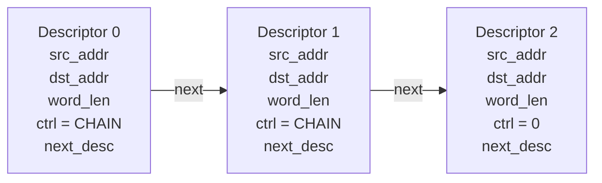
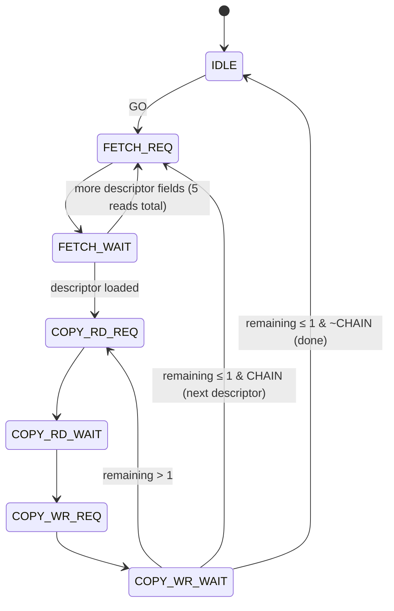

# OpenSoC Scatter-Gather DMA Engine

## Overview

The Scatter-Gather DMA engine performs autonomous memory-to-memory word copy operations driven by linked descriptor chains stored in DRAM. The CPU sets up a descriptor list, writes the first descriptor address, and triggers GO. The DMA engine fetches each descriptor, executes the copy, and follows the chain until a descriptor without the CHAIN bit is reached.

- **Descriptor-driven** — 5-word descriptors in DRAM define each transfer
- **Chained transfers** — descriptors link to the next via `next_desc_addr`
- **Zero-copy setup** — descriptors live in regular memory, no special FIFO
- **DMA master port** — reads/writes memory via the AXI4 crossbar
- **Completion counter** — tracks how many descriptors have been processed
- **Debug registers** — live view of active source, destination, and remaining words

Base address: `0x90000` (1 kB window). IRQ: `irq_fast_i[5]`.

## Architecture

```
sg_dma.sv (single file)
├── Control register interface (slave via axi_to_mem)
├── Descriptor fetch engine (reads 5-word struct from DRAM)
├── Copy engine (read word → write word loop)
└── DMA master port (to axi_from_mem)
```

### SoC Integration

- **Slave port**: crossbar slave index 8, address `0x90000`
- **Master port**: crossbar master index 4, via `axi_from_mem` bridge
- **IRQ**: `irq_fast_i[5]`, level-sensitive (`done & ier_done`)

## Descriptor Format

Each descriptor is a 5-word (20-byte) struct stored in DRAM at a word-aligned address:

| Word Offset | Field | Description |
|-------------|-------|-------------|
| 0x00 | src_addr | Source start address (word-aligned) |
| 0x04 | dst_addr | Destination start address (word-aligned) |
| 0x08 | word_len | Number of 32-bit words to transfer |
| 0x0C | ctrl | Control bits (see below) |
| 0x10 | next_desc_addr | Address of next descriptor (if CHAIN=1) |

### Descriptor ctrl Field

| Bit | Name | Description |
|-----|------|-------------|
| 0 | IRQ_ON_DONE | Assert interrupt when this descriptor completes |
| 1 | CHAIN | Follow `next_desc_addr` to process another descriptor |

### Descriptor Chaining



### Zero-Length Descriptors

If `word_len` is 0, the DMA engine skips the copy phase entirely: it increments the completion counter and immediately checks the CHAIN bit. This is useful for triggering interrupts or as sentinel descriptors.

## FSM



7 states, single DMA master port shared between descriptor fetch and data copy.

### Throughput

Each word copy requires: RD_REQ → RD_WAIT → WR_REQ → WR_WAIT = ~4-6 cycles depending on bus latency. Descriptor fetch adds ~10-15 cycles overhead per descriptor (5 word reads). Measured throughput: ~6.8 cycles/word for a 256-word single descriptor transfer.

## Register Map

Base address: `0x90000`.

| Offset | Name | Access | Description |
|--------|------|--------|-------------|
| 0x00 | DESC_ADDR | RW | First descriptor address in DRAM |
| 0x04 | CTRL | W | GO[0] — starts DMA (ignored if BUSY) |
| 0x08 | STATUS | RO | BUSY[0], DONE[1] |
| 0x0C | IER | RW | Done interrupt enable[0] |
| 0x10 | COMPLETED_CNT | RO | Number of completed descriptors (cleared on GO) |
| 0x14 | ACTIVE_SRC | RO | Debug: current source address |
| 0x18 | ACTIVE_DST | RO | Debug: current destination address |
| 0x1C | ACTIVE_LEN | RO | Debug: remaining word count |

### STATUS Register (0x08)

| Bit | Name | Description |
|-----|------|-------------|
| 0 | BUSY | Transfer in progress |
| 1 | DONE | All descriptors complete |

### Behavior Notes

- **GO while BUSY** is silently ignored
- **COMPLETED_CNT** is cleared to 0 on every GO pulse
- **DONE** is cleared on GO, set when the last descriptor (CHAIN=0) completes
- All addresses must be **word-aligned** (4-byte boundary)
- The DMA engine always uses full-word (32-bit) transfers

## Interrupt

```
irq_o = done_q & ier_done_q
```

Level-sensitive. The CPU should read STATUS to confirm DONE, then clear IER or handle as needed. The DONE flag persists until the next GO.

## Programming Guide

### Single Transfer

```c
// Copy 64 words from 0x100100 to 0x100400
// Build descriptor in memory
uint32_t desc[5];
desc[0] = 0x100100;    // src_addr
desc[1] = 0x100400;    // dst_addr
desc[2] = 64;          // word_len
desc[3] = 0;           // ctrl: no chain, no IRQ
desc[4] = 0;           // next_desc (unused)

// Point DMA to descriptor and start
DEV_WRITE(SGDMA_DESC_ADDR, (uint32_t)desc);
DEV_WRITE(SGDMA_CTRL, SGDMA_CTRL_GO);

// Wait for completion
while (!(DEV_READ(SGDMA_STATUS, 0) & SGDMA_STATUS_DONE))
    ;
```

### Chained Transfers

```c
// Two chained transfers
uint32_t desc0[5] = {
    0x100100,           // src
    0x100400,           // dst
    32,                 // 32 words
    SGDMA_DESC_CTRL_CHAIN,  // chain to next
    (uint32_t)desc1     // next descriptor address
};

uint32_t desc1[5] = {
    0x100200,           // src
    0x100500,           // dst
    16,                 // 16 words
    0,                  // no chain — last descriptor
    0
};

DEV_WRITE(SGDMA_DESC_ADDR, (uint32_t)desc0);
DEV_WRITE(SGDMA_CTRL, SGDMA_CTRL_GO);
```

### Monitoring Progress

```c
// Check how many descriptors have completed
uint32_t completed = DEV_READ(SGDMA_COMPLETED_CNT, 0);

// Check current transfer position
uint32_t active_src = DEV_READ(SGDMA_ACTIVE_SRC, 0);
uint32_t active_dst = DEV_READ(SGDMA_ACTIVE_DST, 0);
uint32_t remaining  = DEV_READ(SGDMA_ACTIVE_LEN, 0);
```

## C Header Definitions

From `sw/include/opensoc_regs.h`:

```c
#define SGDMA_BASE          0x90000

#define SGDMA_DESC_ADDR     (SGDMA_BASE + 0x00)
#define SGDMA_CTRL          (SGDMA_BASE + 0x04)
#define SGDMA_STATUS        (SGDMA_BASE + 0x08)
#define SGDMA_IER           (SGDMA_BASE + 0x0C)
#define SGDMA_COMPLETED_CNT (SGDMA_BASE + 0x10)
#define SGDMA_ACTIVE_SRC    (SGDMA_BASE + 0x14)
#define SGDMA_ACTIVE_DST    (SGDMA_BASE + 0x18)
#define SGDMA_ACTIVE_LEN    (SGDMA_BASE + 0x1C)

#define SGDMA_CTRL_GO       0x1
#define SGDMA_STATUS_BUSY   0x1
#define SGDMA_STATUS_DONE   0x2

#define SGDMA_DESC_CTRL_IRQ_ON_DONE 0x1
#define SGDMA_DESC_CTRL_CHAIN       0x2

#define IRQ_SGDMA   5
```

## File Structure

```
hw/ip/sg_dma/
├── sg_dma.core          — FuseSoC core (opensoc:ip:sg_dma)
└── rtl/
    └── sg_dma.sv        — Single-file: registers + 7-state FSM + DMA engine
```
