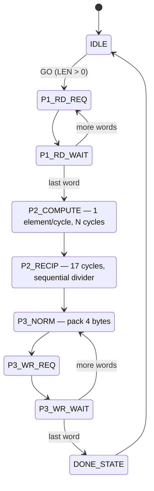

# OpenSoC Softmax Pipeline Accelerator

## Overview

The Softmax pipeline computes the softmax function over INT8 input vectors, producing UINT8 normalized output. It operates in three passes using an internal 256-byte buffer and LUT-based exp() approximation:

```
output[i] = round(255 * exp(input[i] - max) / sum(exp(input[j] - max)))
```

- **Three-pass streaming pipeline** — max find, exp+sum, normalize+write
- **LUT-based exp() approximation** — 256-entry combinational ROM, no multipliers in exp path
- **Fixed-point normalization** — reciprocal division computed once, then multiply+shift per element
- **Internal 256-byte buffer** — data stays on-chip between passes (no re-reads from DRAM)
- **DMA master port** — reads input from / writes output to DRAM
- **Debug registers** — MAX_VAL and SUM_VAL readable after completion

Base address: `0xA0000` (1 kB window). IRQ: `irq_fast_i[6]`.

## Architecture

```
softmax.sv (control + DMA FSM + buffer)
├── softmax_core.sv    — Pure combinational: exp LUT lookup + normalize multiply
│   └── exp_lut.sv     — 256-entry exp() ROM
├── buffer[256]        — Internal 256 × 8-bit register array
└── Sequential divider — 17-cycle restoring division for reciprocal
```

### SoC Integration

- **Slave port**: crossbar slave index 9, address `0xA0000`
- **Master port**: crossbar master index 5, via `axi_from_mem` bridge
- **IRQ**: `irq_fast_i[6]`, level-sensitive (`done & ier_done`)

## Algorithm

### Pass 1: DMA Read + Max Find

Reads the input vector from DRAM one word at a time (4 INT8 elements per word). Each element is stored in the internal buffer. The maximum value across all elements is tracked.

```
for each word in input:
    unpack 4 INT8 bytes → buffer
    update max if any byte > current max
```

### Pass 2: Exp + Sum (internal, 1 element/cycle)

For each element in the buffer, computes `exp(max - element)` via the LUT and accumulates the sum. The buffer is overwritten in-place with exp values.

```
sum = 0
for i = 0..N-1:
    diff = max - buffer[i]        (0..255, always non-negative)
    buffer[i] = exp_lut[diff]     (UINT8, 1..255)
    sum += buffer[i]
```

### Reciprocal Division (17 cycles)

After Pass 2, computes `recip = 65536 / sum` using a 17-cycle restoring sequential divider. This is computed once and reused for all elements in Pass 3.

### Pass 3: Normalize + DMA Write

For each element, computes the normalized output and packs 4 UINT8 results per word before writing via DMA.

```
for i = 0..N-1:
    result = (buffer[i] * recip) >> 8    (clamped to 0..255)
    pack into 32-bit word (every 4 elements → DMA write)
```

## Exp LUT

The `exp_lut.sv` module provides a 256-entry combinational ROM:

```
exp_lut[index] = round(255 * exp(-index / 46.0))
```

| Index | Value | Approximation |
|-------|-------|---------------|
| 0 | 255 | exp(0) = 1.0 |
| 32 | 127 | exp(-0.70) ~ 0.50 |
| 46 | 94 | exp(-1.0) ~ 0.37 |
| 92 | 35 | exp(-2.0) ~ 0.14 |
| 255 | 1 | exp(-5.5) ~ 0.004 |

The scale factor of 46 ensures the smallest entry is 1 (never 0), preventing division-by-zero in normalization. The maximum sum for a 256-element vector is 256 × 255 = 65,280, which fits in 16 bits.

## Normalization

The `softmax_core.sv` module computes:

```
norm_out = (exp_val * recip) >> 8
```

Where `recip = 65536 / sum` (17-bit). The maximum product is 255 × 257 = 65,535 (16 bits). After right-shifting by 8, the maximum result is 255. A clamp handles edge-case overflow.

### Accuracy

The LUT-based approximation matches the mathematical softmax within ±2 LSB for typical input distributions. The tolerance is verified in the test suite against a C reference implementation.

## FSM



9 states. Pass 2 and the reciprocal divider are fully internal (no DMA transactions).

### Timing Breakdown (N-element vector)

| Phase | Cycles | Description |
|-------|--------|-------------|
| Pass 1 | ~2N/4 + overhead | N/4 DMA reads |
| Pass 2 | N | 1 element/cycle exp+sum |
| Reciprocal | 17 | Sequential divider |
| Pass 3 | N + N/4 × ~4 | N normalize + N/4 DMA writes |

## Register Map

Base address: `0xA0000`.

| Offset | Name | Access | Description |
|--------|------|--------|-------------|
| 0x00 | CTRL | W | GO[0] — starts computation (ignored if BUSY) |
| 0x04 | STATUS | RO | BUSY[0], DONE[1] |
| 0x08 | SRC_ADDR | RW | Input vector base address (word-aligned) |
| 0x0C | DST_ADDR | RW | Output vector base address (word-aligned) |
| 0x10 | VEC_LEN | RW | Number of INT8 elements (1-256, must be multiple of 4) |
| 0x14 | IER | RW | Done interrupt enable[0] |
| 0x18 | MAX_VAL | RO | Debug: max input value (sign-extended INT8 → INT32) |
| 0x1C | SUM_VAL | RO | Debug: sum of exp values from Pass 2 (24-bit) |

### VEC_LEN Constraints

- Must be a multiple of 4 (elements are packed 4 per word)
- Maximum 256 (limited by internal buffer size)
- VEC_LEN=0: immediate DONE, no DMA transactions

### Debug Registers

**MAX_VAL (0x18):** The maximum signed INT8 value found during Pass 1, sign-extended to 32 bits. Useful for verifying the max-subtraction step.

**SUM_VAL (0x1C):** The sum of all exp() values from Pass 2 (24-bit unsigned). Useful for verifying normalization: all output elements should sum to approximately 255.

## Interrupt

```
irq_o = done_q & ier_done_q
```

Level-sensitive. DONE persists until the next GO.

## Programming Guide

### Basic Softmax

```c
int8_t input[64]  = { ... };
uint8_t output[64];

DEV_WRITE(SMAX_SRC_ADDR, (uint32_t)input);
DEV_WRITE(SMAX_DST_ADDR, (uint32_t)output);
DEV_WRITE(SMAX_VEC_LEN,  64);
DEV_WRITE(SMAX_CTRL,     SMAX_CTRL_GO);

while (!(DEV_READ(SMAX_STATUS, 0) & SMAX_STATUS_DONE))
    ;

// output[] now contains softmax-normalized UINT8 values
```

### Reading Debug Registers

```c
// After completion, inspect internals
int32_t  max_val = (int32_t)DEV_READ(SMAX_MAX_VAL, 0);
uint32_t sum_val = DEV_READ(SMAX_SUM_VAL, 0);

// Verify: sum of output[] should be ~255
uint32_t out_sum = 0;
for (int i = 0; i < 64; i++) out_sum += output[i];
// out_sum ≈ 255 (±2 due to rounding)
```

### One-Hot Detection

When one element dominates, softmax produces a near one-hot output:

```c
// Input: [100, 0, 0, 0] → exp diffs: [0, 100, 100, 100]
// LUT:   [255, 29, 29, 29] → sum = 342
// Norm:  [190, 22, 22, 22] → sum ≈ 256
```

## C Header Definitions

From `sw/include/opensoc_regs.h`:

```c
#define SMAX_BASE       0xA0000

#define SMAX_CTRL       (SMAX_BASE + 0x00)
#define SMAX_STATUS     (SMAX_BASE + 0x04)
#define SMAX_SRC_ADDR   (SMAX_BASE + 0x08)
#define SMAX_DST_ADDR   (SMAX_BASE + 0x0C)
#define SMAX_VEC_LEN    (SMAX_BASE + 0x10)
#define SMAX_IER        (SMAX_BASE + 0x14)
#define SMAX_MAX_VAL    (SMAX_BASE + 0x18)
#define SMAX_SUM_VAL    (SMAX_BASE + 0x1C)

#define SMAX_CTRL_GO      0x1
#define SMAX_STATUS_BUSY  0x1
#define SMAX_STATUS_DONE  0x2

#define IRQ_SMAX    6
```

## File Structure

```
hw/ip/softmax/
├── softmax.core          — FuseSoC core (opensoc:ip:softmax)
└── rtl/
    ├── softmax.sv        — Control registers + 9-state FSM + DMA + buffer
    ├── softmax_core.sv   — Combinational: exp LUT + normalize multiply
    └── exp_lut.sv        — 256-entry exp() ROM
```
