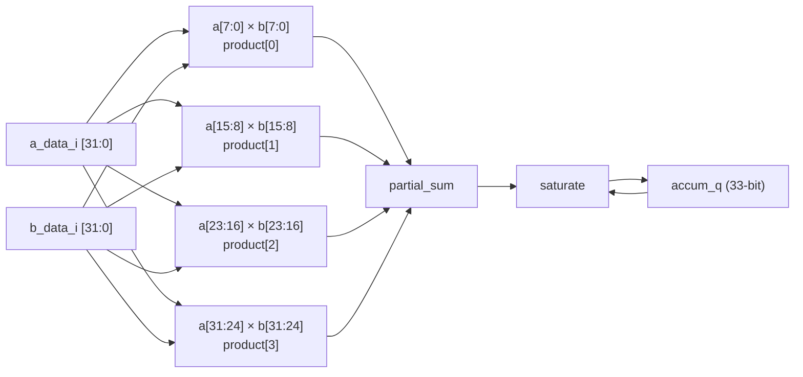
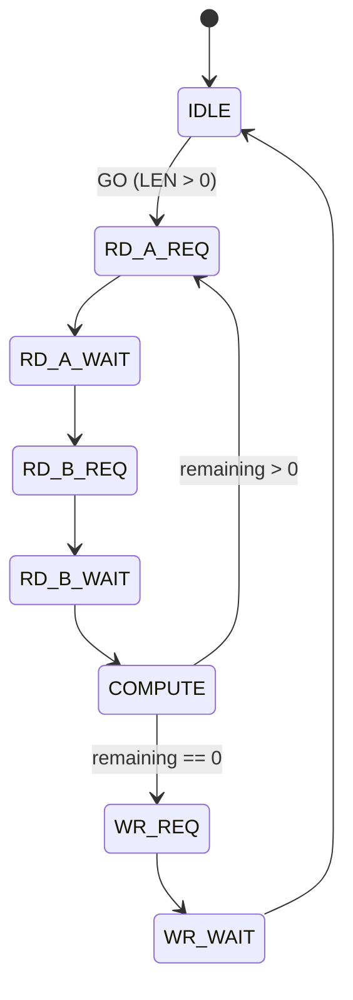

# OpenSoC Vector MAC Accelerator

## Overview

The Vector MAC (Multiply-Accumulate) accelerator computes the dot product of two INT8 vectors stored in memory, producing a saturating INT32 result:

```
result = sum(A[i] * B[i]) for i = 0..N-1, saturated to INT32
```

The accelerator reads vectors A and B from DRAM via a DMA master port, processes 4 INT8 elements per clock cycle through parallel multipliers, accumulates the results with saturation, and writes the final scalar result back to a destination address.

- **4-lane parallel INT8 MAC** — processes 4 element pairs per cycle
- **Saturating INT32 accumulator** — clamps to [-2^31, 2^31-1]
- **Multi-kick accumulation** — NO_ACCUM_CLEAR allows chaining across operations
- **DMA master port** — time-multiplexed A/B reads through single AXI port
- **Zero-length support** — LEN=0 produces immediate DONE (clears accumulator unless NO_ACCUM_CLEAR)

Base address: `0x80000` (1 kB window). IRQ: `irq_fast_i[4]`.

## Architecture

```
vec_mac.sv (control + DMA FSM)
├── vec_mac_core.sv    — Pure compute: 4× INT8 multipliers + saturating accumulator
└── DMA engine         — 8-state FSM, time-multiplexed A/B reads
```

### SoC Integration

- **Slave port**: crossbar slave index 7, address `0x80000`
- **Master port**: crossbar master index 3, via `axi_from_mem` bridge
- **IRQ**: `irq_fast_i[4]`, level-sensitive (`done & ier_done`)

## Compute Core (vec_mac_core.sv)

### Data Path



- **4 parallel lanes**: each unpacks one signed INT8 byte from A and B, multiplies to produce a signed 16-bit product
- **Partial sum**: all 4 products summed in a single cycle (33-bit wide to avoid overflow)
- **Accumulator**: 33-bit signed register, saturates to INT32 range on each accumulation
- **Saturation bounds**: +2,147,483,647 (positive) / -2,147,483,648 (negative)

### Element Packing

Elements are packed little-endian: lane 0 reads `word[7:0]`, lane 1 reads `word[15:8]`, etc. Each 32-bit DMA word contains 4 INT8 elements.

## FSM



8 states. The DMA port is time-multiplexed: each iteration reads one word from A, then one word from B, then computes. After all words are processed, the result is written to the destination address.

### LEN=0 Handling

If LEN=0 on GO: the accelerator stays in IDLE, sets DONE immediately, and clears the accumulator (unless NO_ACCUM_CLEAR is set). No DMA transactions occur.

## Register Map

Base address: `0x80000`.

| Offset | Name | Access | Description |
|--------|------|--------|-------------|
| 0x00 | SRC_A_ADDR | RW | Vector A source address (word-aligned) |
| 0x04 | SRC_B_ADDR | RW | Vector B source address (word-aligned) |
| 0x08 | DST_ADDR | RW | Result destination address (word-aligned) |
| 0x0C | LEN | RW | Number of INT8 elements per vector |
| 0x10 | CTRL | W | GO[0], NO_ACCUM_CLEAR[1] (sampled on GO) |
| 0x14 | STATUS | RO | BUSY[0], DONE[1] |
| 0x18 | IER | RW | Done interrupt enable[0] |
| 0x1C | RESULT | RO | Current accumulator value (INT32) |

### CTRL Register (0x10)

| Bit | Name | Description |
|-----|------|-------------|
| 0 | GO | Start computation (ignored if BUSY) |
| 1 | NO_ACCUM_CLEAR | If set, preserve accumulator from previous operation |

NO_ACCUM_CLEAR is sampled on the rising edge of GO — it is not stored persistently.

### LEN Register

LEN specifies the number of INT8 elements (not words). Hardware converts to word count via `len >> 2` (NUM_LANES=4). LEN should be a multiple of 4; low bits are masked off.

### RESULT Register (0x1C)

Always reflects the current accumulator value, readable at any time (even during computation). After DONE, this contains the final dot product result. The same value is also written to DST_ADDR via DMA.

## Multi-Kick Accumulation

The NO_ACCUM_CLEAR feature allows computing dot products larger than a single operation by chaining multiple kicks:

```c
// Compute dot(A[0..255], B[0..255]) in two 128-element chunks
DEV_WRITE(VMAC_SRC_A_ADDR, (uint32_t)&A[0]);
DEV_WRITE(VMAC_SRC_B_ADDR, (uint32_t)&B[0]);
DEV_WRITE(VMAC_DST_ADDR,   (uint32_t)&result);
DEV_WRITE(VMAC_LEN, 128);
DEV_WRITE(VMAC_CTRL, VMAC_CTRL_GO);  // clears accumulator, computes first half
while (!(DEV_READ(VMAC_STATUS, 0) & VMAC_STATUS_DONE)) ;

DEV_WRITE(VMAC_SRC_A_ADDR, (uint32_t)&A[128]);
DEV_WRITE(VMAC_SRC_B_ADDR, (uint32_t)&B[128]);
DEV_WRITE(VMAC_LEN, 128);
DEV_WRITE(VMAC_CTRL, VMAC_CTRL_GO | VMAC_CTRL_NO_ACCUM_CLEAR);  // keeps accumulator
while (!(DEV_READ(VMAC_STATUS, 0) & VMAC_STATUS_DONE)) ;

// result now contains dot(A[0..255], B[0..255])
```

## Interrupt

```
irq_o = done_q & ier_done_q
```

Level-sensitive. DONE persists until the next GO.

## Programming Guide

### Basic Dot Product

```c
int8_t A[32] = { ... };
int8_t B[32] = { ... };
int32_t result;

DEV_WRITE(VMAC_SRC_A_ADDR, (uint32_t)A);
DEV_WRITE(VMAC_SRC_B_ADDR, (uint32_t)B);
DEV_WRITE(VMAC_DST_ADDR,   (uint32_t)&result);
DEV_WRITE(VMAC_LEN, 32);
DEV_WRITE(VMAC_CTRL, VMAC_CTRL_GO);

while (!(DEV_READ(VMAC_STATUS, 0) & VMAC_STATUS_DONE))
    ;

// result is now written at &result
// Also readable via: int32_t r = DEV_READ(VMAC_RESULT, 0);
```

### Reading the Accumulator

The RESULT register can be read at any time without waiting for DONE:

```c
// Read running accumulator value (e.g., for progress monitoring)
int32_t partial = (int32_t)DEV_READ(VMAC_RESULT, 0);
```

## C Header Definitions

From `sw/include/opensoc_regs.h`:

```c
#define VMAC_BASE       0x80000

#define VMAC_SRC_A_ADDR (VMAC_BASE + 0x00)
#define VMAC_SRC_B_ADDR (VMAC_BASE + 0x04)
#define VMAC_DST_ADDR   (VMAC_BASE + 0x08)
#define VMAC_LEN        (VMAC_BASE + 0x0C)
#define VMAC_CTRL       (VMAC_BASE + 0x10)
#define VMAC_STATUS     (VMAC_BASE + 0x14)
#define VMAC_IER        (VMAC_BASE + 0x18)
#define VMAC_RESULT     (VMAC_BASE + 0x1C)

#define VMAC_CTRL_GO             0x1
#define VMAC_CTRL_NO_ACCUM_CLEAR 0x2
#define VMAC_STATUS_BUSY         0x1
#define VMAC_STATUS_DONE         0x2

#define IRQ_VMAC    4
```

## File Structure

```
hw/ip/vec_mac/
├── vec_mac.core          — FuseSoC core (opensoc:ip:vec_mac)
└── rtl/
    ├── vec_mac.sv        — Control registers + 8-state DMA FSM
    └── vec_mac_core.sv   — 4-lane INT8 multiplier array + saturating accumulator
```
