# hw/ip/arith Architecture Reference

**Library:** parameterized signed adders + multipliers &nbsp;|&nbsp; **Default consumer:** `vec_mac_core` &nbsp;|&nbsp; **Build:** FuseSoC core, ASIC + FPGA + simulation

The `arith` library provides compile-time-selectable arithmetic primitives: a signed adder (`adder.sv`) and a signed multiplier (`mul_signed.sv`), each dispatching to one of several microarchitectures via a `KIND` parameter resolved at elaboration. Both modules share a common latency contract: output appears exactly `PIPE_STAGES` cycles after the inputs are sampled, where `PIPE_STAGES=0` gives a purely combinational path. Pipeline registers live in the dispatcher module; all body modules are unconditionally combinational and carry no `clk` or `rst` ports. The library's primary consumer is `vec_mac_core`, which instantiates `mul_signed` × `NUM_LANES` and an explicit reduction adder tree to produce a saturating INT32 accumulator output.

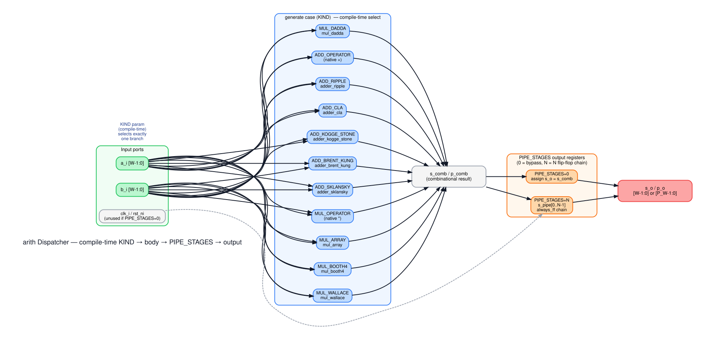

---

## 1. Library Layout

```
hw/ip/arith/rtl/
├── arith_pkg.sv          — add_kind_e + mul_kind_e enumerations (used by all callers)
├── adder.sv              — Dispatcher: KIND-selects one adder body, owns PIPE_STAGES regs
├── adder_ripple.sv       — Ripple-carry chain (O(W) depth, O(W) FAs)
├── adder_cla.sv          — Carry-Lookahead Adder, 4-bit blocks chained
├── adder_kogge_stone.sv  — Kogge-Stone parallel prefix (O(log₂W) depth, max fan-out 2)
├── adder_brent_kung.sv   — Brent-Kung two-phase prefix (~2W cells, 2×log₂W−1 depth)
├── adder_sklansky.sv     — Sklansky single-phase prefix (O(log₂W), growing fan-out)
├── mul_signed.sv         — Dispatcher: KIND-selects one multiplier body, owns PIPE_STAGES regs
├── mul_array.sv          — Shift-and-add row array (O(B_W) depth)
├── mul_booth4.sv         — Radix-4 Modified Booth (ceil(B_W/2) partial products)
├── mul_wallace.sv        — Wallace tree CSA reduction (O(log₁.₅ B_W) depth)
└── mul_dadda.sv          — Dadda tree CSA reduction (minimum-CSA variant of Wallace)
```

---

## 2. Dispatcher Contract

### 2a. `adder.sv`

```systemverilog
module adder
  import arith_pkg::*;
#(
  parameter int unsigned W           = 32,
  parameter add_kind_e   KIND        = ADD_OPERATOR,
  parameter int unsigned PIPE_STAGES = 0
) (
  input  logic                clk_i,
  input  logic                rst_ni,
  input  logic signed [W-1:0] a_i,
  input  logic signed [W-1:0] b_i,
  output logic signed [W-1:0] s_o
);
```

`KIND` values (from `arith_pkg::add_kind_e`):

| Value | Body | Description |
|-------|------|-------------|
| `ADD_OPERATOR` (default) | native `+` | Synthesis-inferred; synthesizer chooses carry structure |
| `ADD_RIPPLE` | `adder_ripple` | Explicit full-adder chain |
| `ADD_CLA` | `adder_cla` | 4-bit CLA blocks chained |
| `ADD_KOGGE_STONE` | `adder_kogge_stone` | Parallel prefix, minimum depth |
| `ADD_BRENT_KUNG` | `adder_brent_kung` | Two-phase prefix, minimum cells |
| `ADD_SKLANSKY` | `adder_sklansky` | Single-phase prefix, simple wiring |

### 2b. `mul_signed.sv`

```systemverilog
module mul_signed
  import arith_pkg::*;
#(
  parameter int unsigned A_W         = 8,
  parameter int unsigned B_W         = 8,
  parameter int unsigned P_W         = A_W + B_W,
  parameter mul_kind_e   KIND        = MUL_OPERATOR,
  parameter int unsigned PIPE_STAGES = 0
) (
  input  logic                  clk_i,
  input  logic                  rst_ni,
  input  logic signed [A_W-1:0] a_i,
  input  logic signed [B_W-1:0] b_i,
  output logic signed [P_W-1:0] p_o
);
```

`KIND` values (from `arith_pkg::mul_kind_e`):

| Value | Body | Description |
|-------|------|-------------|
| `MUL_OPERATOR` (default) | native `*` | Synthesis-inferred; maps to DSP48 on Xilinx unless `use_dsp="no"` |
| `MUL_ARRAY` | `mul_array` | Shift-and-add row array (LUT-mapped) |
| `MUL_BOOTH4` | `mul_booth4` | Radix-4 Modified Booth (LUT-mapped) |
| `MUL_WALLACE` | `mul_wallace` | Wallace CSA tree (LUT-mapped) |
| `MUL_DADDA` | `mul_dadda` | Dadda CSA tree (LUT-mapped, minimum cells) |

**Latency contract:** `s_o` / `p_o` appears exactly `PIPE_STAGES` clock cycles after `a_i` / `b_i` are presented. At `PIPE_STAGES=0`, the output is purely combinational: `clk_i` and `rst_ni` are unused (the dispatcher wraps them in `/* verilator lint_off UNUSEDSIGNAL */`). At `PIPE_STAGES=N`, the dispatcher inserts an N-deep flip-flop chain on the combinational result; `rst_ni` resets it to zero.

Body modules must be purely combinational: they take `a_i`, `b_i`, and produce the result directly. They have no `clk` or `rst` ports and no internal state.

---

## 3. Adder Implementations

### Complexity summary

| Kind | Depth | Cells | Max fan-out |
|------|-------|-------|-------------|
| Ripple | O(W) | W FAs | 1 |
| CLA | O(W/B + B) | O(W) with block size B | O(B) |
| Kogge-Stone | O(log₂W) | W·log₂W | 2 |
| Brent-Kung | O(2·log₂W − 1) | ~2W | 2 |
| Sklansky | O(log₂W) | (W/2)·log₂W | W/2 |

### 3a. Ripple-Carry (`adder_ripple`)

The ripple-carry adder is the simplest possible structure: a linear chain of W full-adder (FA) cells. FA[0] receives carry-in 0 (or the explicit `c_in` for the general case). Each FA[i] produces `s[i] = a[i] ^ b[i] ^ c[i]` and `c[i+1] = majority(a[i], b[i], c[i])`. The carry must ripple from bit 0 to bit W−1 before all sum bits are valid, giving a worst-case path of W gate delays.

Despite its linear depth, the ripple adder is optimal in cell count (W FAs) and has fan-out 1 on every net — a property that makes it area-efficient and easy for standard-cell place-and-route for small W. It is the baseline implementation for correctness comparison.

*Reference: Weste & Harris, "CMOS VLSI Design," Chapter 11.*

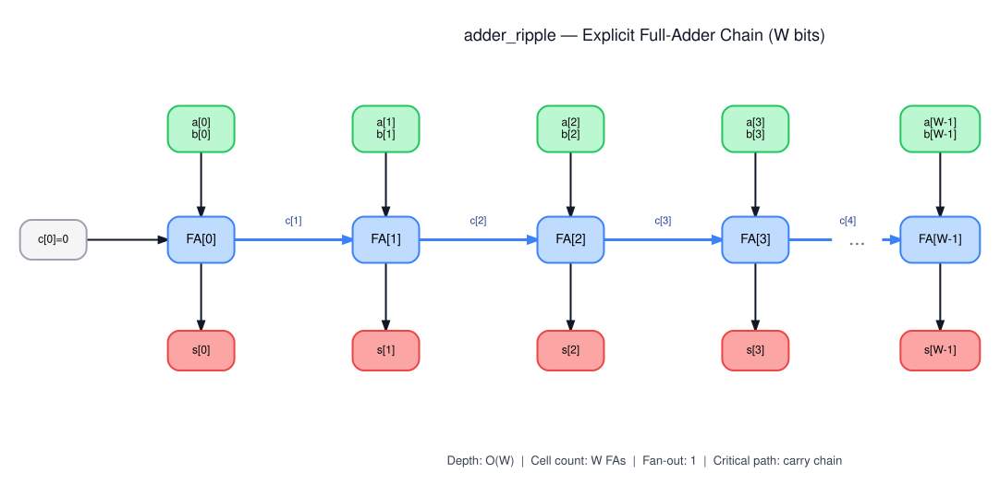

### 3b. Carry-Lookahead (`adder_cla`)

The CLA adder splits the word into 4-bit blocks. Within each block, bit-level generate (`g_i = a_i & b_i`) and propagate (`p_i = a_i | b_i`) signals are computed in one gate level. A lookahead unit then simultaneously computes all internal carries within the block using the recursive expansion:

```
G_k = g_k | (p_k & G_{k-1})
P_k = p_k & P_{k-1}
C_out = G_k | (P_k & C_in)
```

*The diagram shows three chained 4-bit blocks (W=12) for illustration; in practice W is set by the parent module (33 in `vec_mac_core`).*

This reduces the intra-block carry depth to O(1) gates (for fixed block size B). Blocks are then chained in ripple fashion for the inter-block carry, giving total depth O(W/B). With B=4 the intra-block lookahead has 3 levels; the inter-block chain adds W/4 levels. A hierarchical CLA (group lookahead) can reduce this further, but `adder_cla.sv` uses the simpler flat-chain variant.

*Reference: Parhami, "Computer Arithmetic," Chapter 6.*

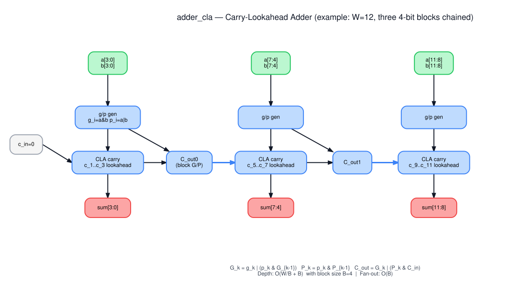

### 3c. Kogge-Stone (`adder_kogge_stone`)

Kogge-Stone is a parallel-prefix tree that achieves O(log₂W) depth with the minimum possible number of levels. The bit-level G/P inputs feed log₂W levels of merge cells. At level k, cell i merges with cell i−2^(k−1), combining their G/P pairs via:

```
G_{i:j} = G_{i:m+1} | (P_{i:m+1} & G_{m:j})
P_{i:j} = P_{i:m+1} & P_{m:j}
```

where m is the split point. After log₂W levels, every cell holds the prefix G and P from bit 0 through bit i, giving carry-in for each sum bit in one additional gate level. The fan-out of each intermediate node is at most 2.

The cost is O(W·log₂W) total merge cells — more than Brent-Kung — but the wire count is manageable for typical datapath widths (W ≤ 64).

*Reference: Kogge & Stone, "A Parallel Algorithm for the Efficient Solution of a General Class of Recurrence Equations," IEEE Trans. Computers, 1973. Also Parhami, "Computer Arithmetic," Chapter 7.*

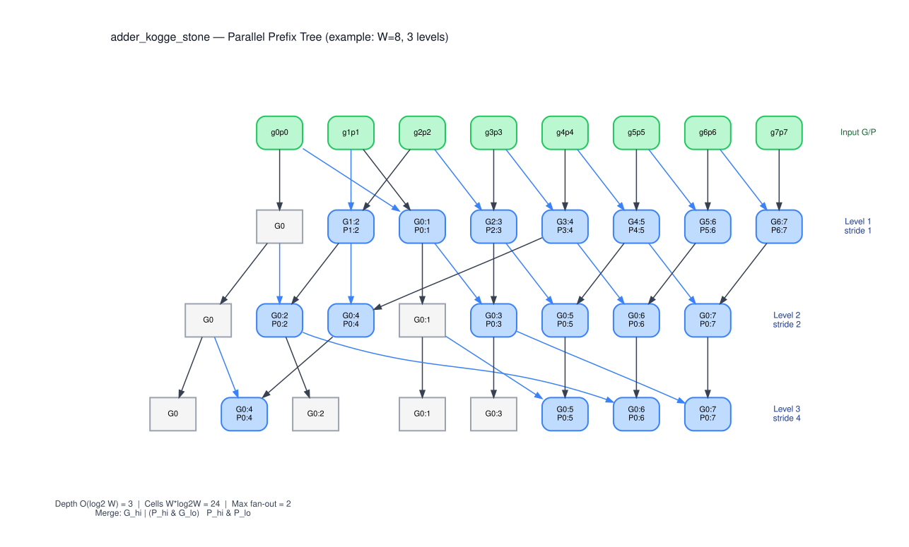

### 3d. Brent-Kung (`adder_brent_kung`)

Brent-Kung uses a two-phase approach to reduce the cell count relative to Kogge-Stone, at the cost of one extra level of latency.

**Phase 1 (up-sweep):** Builds a sparse backbone. Level 1 merges adjacent pairs at positions {1, 3, 5, 7, …}. Level 2 merges at positions {3, 7, 15, …}. After log₂W levels the root node (position W−1) holds the full prefix G.

**Phase 2 (down-sweep):** Fills the gaps between backbone nodes. The backbone G/P values are used as inputs to a symmetric descent, completing all prefix values not computed during Phase 1. Total depth is 2·log₂W − 1 levels; total cell count is approximately 2W — roughly half of Kogge-Stone for the same W.

The fan-out remains 2 throughout, so Brent-Kung is area-efficient and wire-efficient. It is the standard choice for synthesis when the extra latency stage versus Kogge-Stone is acceptable.

*Reference: Brent & Kung, "A Regular Layout for Parallel Adders," IEEE Trans. Computers, 1982.*

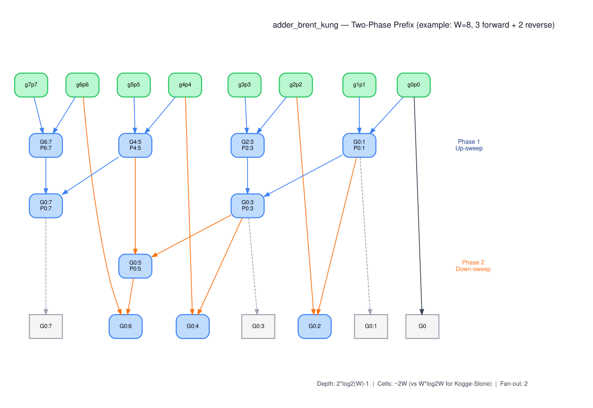

### 3e. Sklansky (`adder_sklansky`)

Sklansky's scheme is also a parallel-prefix tree with O(log₂W) depth, but uses a different cell assignment: at level k, the word is divided into groups of 2^k bits. Within each group, the leftmost-merged cell of the left half (the "pivot") drives all cells in the right half. This gives a simple, regular layout with only (W/2)·log₂W merge cells.

The drawback is growing pivot fan-out: at level k the pivot drives 2^(k−1) cells, reaching W/2 at the final level. For large W this becomes a significant wiring burden and can hurt timing on metal-constrained processes.

*Reference: Sklansky, "Conditional-Sum Addition Logic," IRE Trans. Electronic Computers, 1960. Also Weste & Harris, "CMOS VLSI Design," Section 11.2.*

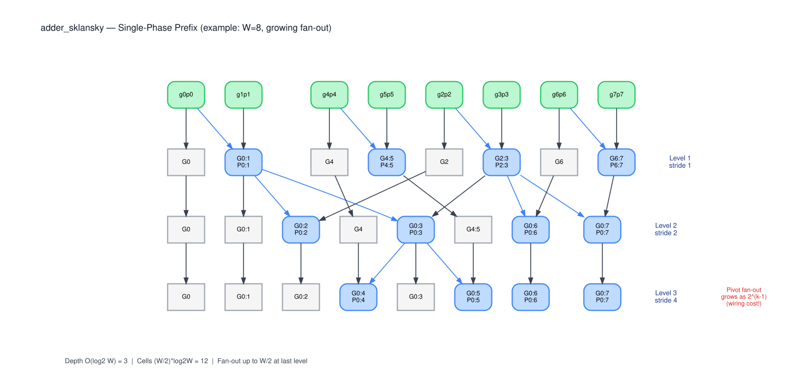

---

## 4. Multiplier Implementations

### Complexity summary

| Kind | Partial products | Reduction depth | Cell count |
|------|-----------------|-----------------|------------|
| Array | B_W | O(B_W) adder stages | O(B_W · P_W) |
| Booth-4 | ⌈B_W/2⌉ | O(B_W/2) adder stages | O(B_W/2 · P_W) |
| Wallace | B_W | O(log₁.₅ B_W) CSA levels | O(B_W · P_W) (more CSAs at early levels) |
| Dadda | B_W | O(log₁.₅ B_W) CSA levels | O(B_W · P_W) (minimum-CSA principle) |

### 4a. Array Multiplier (`mul_array`)

The array multiplier is the direct implementation of the textbook shift-and-add algorithm for signed integers. The A operand is sign-extended to P_W bits; B is used in its original two's-complement form. B_W partial products are formed: `PP[i] = b[i] ? (a_ext << i) : 0` for i = 0..B_W−2 (positive-weight rows) and `PP[B_W−1] = b[B_W−1] ? -(a_ext << (B_W−1)) : 0` (the sign-bit row, negated). This implements the two's-complement decomposition `b = -b[N−1]·2^(N−1) + Σ b[i]·2^i`. The B_W partial products are then accumulated in a sequential ripple-add chain of B_W−1 adders.

The array multiplier is the simplest correct implementation and serves as a functional reference. Its O(B_W) serial addition depth makes it slow for large B_W, but for small operands (the 8-bit lanes in `vec_mac_core`) it compiles cleanly.

*Reference: Parhami, "Computer Arithmetic," Chapter 11.*

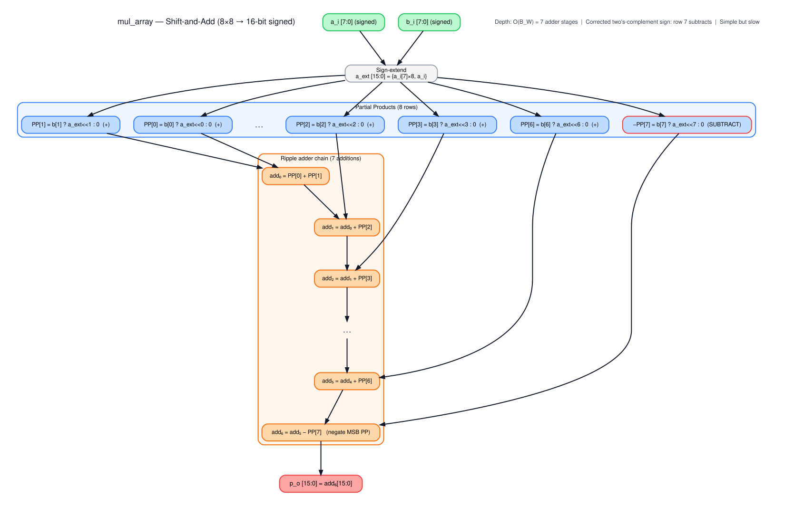

### 4b. Radix-4 Booth (`mul_booth4`)

The Modified Booth algorithm reduces the number of partial products by a factor of 2, from B_W to ⌈B_W/2⌉. The B operand is padded with an implicit `b[-1]=0`, forming a 9-bit digit string for B_W=8. Overlapping windows of 3 bits are extracted at positions 2i+1, 2i, 2i−1. Each window encodes one digit from the set {−2A, −A, 0, +A, +2A}, implemented via a Booth encoder that computes the digit as a combination of the three input bits.

The encoded partial products are sign-extended and accumulated in a ripple-add chain. The Booth encoder logic adds a fixed overhead per window, but the halved partial-product count typically yields a net area and latency saving for B_W ≥ 8.

*Reference: Booth, "A Signed Binary Multiplication Technique," QJME, 1951. Also Parhami, "Computer Arithmetic," Chapter 12.*

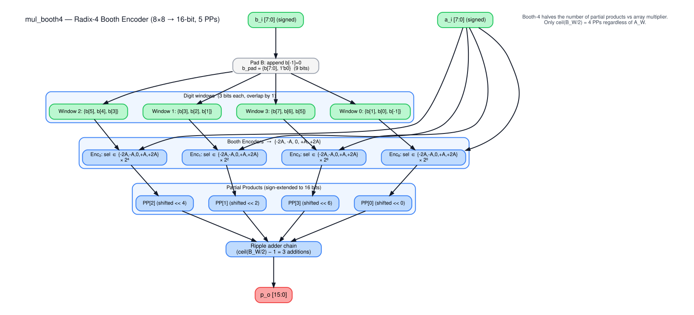

### 4c. Wallace Tree (`mul_wallace`)

The Wallace tree reduces the B_W partial-product rows using carry-save adders (CSAs) rather than ripple-carry adders. A CSA is a 3:2 compressor: it takes 3 rows and outputs 2 (a sum row and a carry row), requiring only one gate level.

Wallace's rule is greedy: at each level, group all available rows into triples and apply CSA to each triple simultaneously. Remaining rows (if the count is not divisible by 3) pass through to the next level. The maximum column height reduces by a factor of 2/3 per level, giving depth O(log₁.₅ B_W). After reduction to 2 rows, a single final carry-propagate adder (CPA) produces the product.

For B_W=8, the height sequence is 8→6→4→3→2, requiring 5 CSA operations in 4 levels plus the final adder.

*Reference: Wallace, "A Suggestion for a Fast Multiplier," IEEE Trans. Electronic Computers, 1964.*

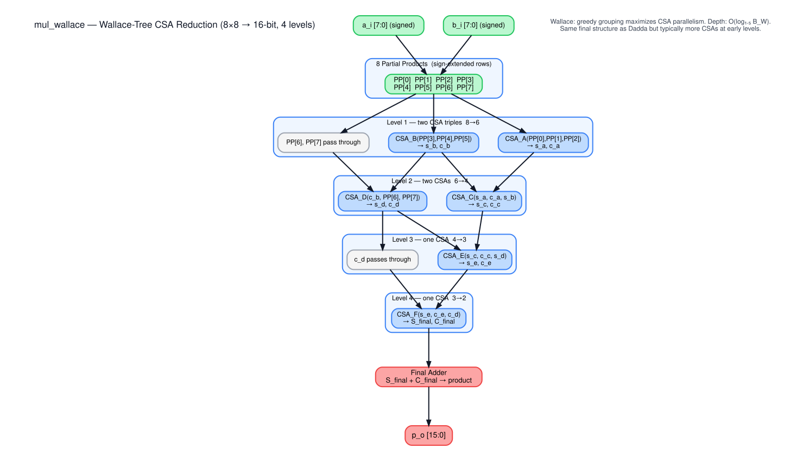

### 4d. Dadda Tree (`mul_dadda`)

The Dadda tree uses the same CSA-based reduction as Wallace, but applies a minimum-CSA principle: at each level, use only the fewest CSAs needed to reduce the maximum column height to the next value in the Dadda sequence {2, 3, 4, 6, 9, 13, …} (the largest integer less than 3/2 times the previous).

For B_W=8, the Dadda target height sequence matches Wallace exactly (8→6→4→3→2), so both require the same number of levels. In practice, Dadda uses fewer CSAs at early levels (where not all columns exceed the target), resulting in a smaller total gate count for the same latency. Both trees produce bitwise-identical numerical results; only the internal wiring differs.

*Reference: Dadda, "Some Schemes for Parallel Multipliers," Alta Frequenza, 1965.*

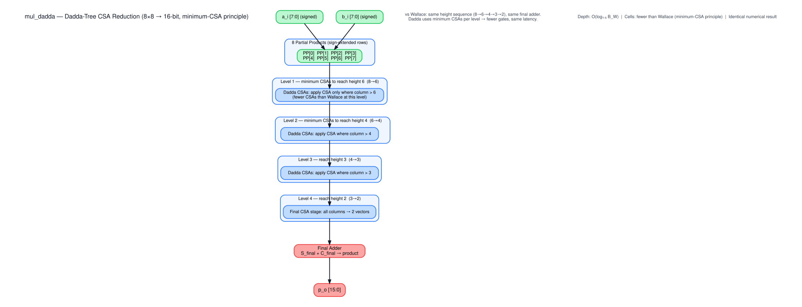

---

## 5. Pipelining

Both dispatchers implement the same register chain:

```systemverilog
generate
  if (PIPE_STAGES == 0) begin : g_pipe0
    assign s_o = s_comb;          // purely combinational
  end else begin : g_pipeN
    logic signed [W-1:0] s_pipe [PIPE_STAGES];
    always_ff @(posedge clk_i or negedge rst_ni) begin
      if (!rst_ni) begin
        for (int i = 0; i < PIPE_STAGES; i++) s_pipe[i] <= '0;
      end else begin
        s_pipe[0] <= s_comb;
        for (int i = 1; i < PIPE_STAGES; i++) s_pipe[i] <= s_pipe[i-1];
      end
    end
    assign s_o = s_pipe[PIPE_STAGES-1];
  end
endgenerate
```

The body modules never see `clk_i` or `rst_ni`. This separation enforces the contract: body = pure logic, dispatcher = timing control.

### PIPE_STAGES = 0 (combinational)

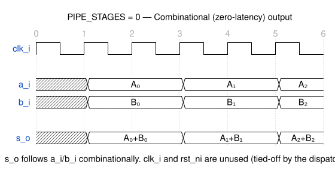

Output appears in the same cycle as the inputs. `clk_i` and `rst_ni` are present in the port list but unused (suppressed with a Verilator lint pragma). The tool can optimize them away entirely.

### PIPE_STAGES = 1 (single registered output)

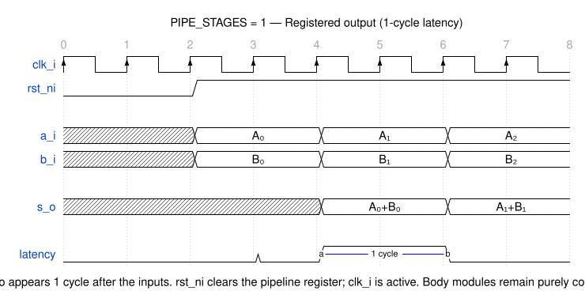

Output appears 1 cycle after the inputs are sampled. The pipeline register is synchronously reset to zero on `rst_ni` deassertion. Throughput is unchanged: new inputs can be presented every cycle. The register stage also provides a timing closure point, breaking the combinational path from inputs through the arithmetic body to the output register in the consuming module.

---

## 6. Integration with `vec_mac_core`

`vec_mac_core` (in `hw/ip/vec_mac/rtl/vec_mac_core.sv`) is the primary consumer of the `arith` library. It instantiates `mul_signed` × `NUM_LANES` with configurable `MUL_PIPE_STAGES`, then builds an explicit adder reduction tree of `adder` instances with `ADD_PIPE_STAGES`, and finally feeds the tree output into a saturating INT32 accumulator.

```
valid_i ─┬─► mul_signed[0] ─► \
          │   mul_signed[1] ─► ─── adder tree ─► reduction_pipe ─► accum_q (INT32)
          │   ...              /
          └──── valid_pipe propagation ──────────────────► accum_update
```

The latency from `valid_i` to accumulator update is:

```
TOTAL_PIPE = MUL_PIPE_STAGES + ADD_PIPE_STAGES
```

`valid_i` is registered through `TOTAL_PIPE` flip-flops (the `valid_pipe` array) before asserting `accum_update`, which gates the accumulator write. This ensures the accumulator sees the correct product-sum result regardless of pipeline depth.

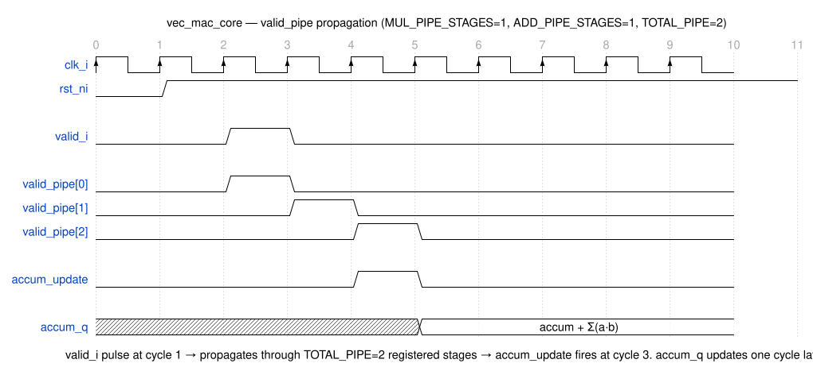

Key details:
- Each lane multiplies a signed 8-bit `a[i]` by a signed 8-bit `b[i]`, producing a 16-bit signed product.
- The reduction tree sums `NUM_LANES` products into a wider intermediate (33-bit `PSUM_W` to avoid overflow across `NUM_LANES=4` lanes).
- The accumulator adder is instantiated with `KIND=ADD_OPERATOR, PIPE_STAGES=0` (combinational); the accumulator register is external to `arith`.
- Saturation clamps `accum_q` to `[SAT_MIN, SAT_MAX]` before writing.

For the wider design context, see `hw/ip/vec_mac/`.

---

## 7. References

1. Parhami, B., *Computer Arithmetic: Algorithms and Hardware Designs*, 2nd ed., Oxford University Press, 2010. — Primary reference for CLA, parallel-prefix adders, and Wallace/Dadda trees (Chapters 6, 7, 11, 12).

2. Brent, R.P. and Kung, H.T., "A Regular Layout for Parallel Adders," *IEEE Transactions on Computers*, vol. C-31, no. 3, pp. 260–264, March 1982.

3. Sklansky, J., "Conditional-Sum Addition Logic," *IRE Transactions on Electronic Computers*, vol. EC-9, pp. 226–231, June 1960.

4. Booth, A.D., "A Signed Binary Multiplication Technique," *Quarterly Journal of Mechanics and Applied Mathematics*, vol. 4, no. 2, pp. 236–240, 1951.

5. Wallace, C.S., "A Suggestion for a Fast Multiplier," *IEEE Transactions on Electronic Computers*, vol. EC-13, no. 1, pp. 14–17, February 1964.

6. Dadda, L., "Some Schemes for Parallel Multipliers," *Alta Frequenza*, vol. 34, pp. 349–356, 1965.

7. Weste, N. and Harris, D., *CMOS VLSI Design: A Circuits and Systems Perspective*, 4th ed., Addison-Wesley, 2011. — Reference for prefix-adder fan-out tradeoffs and standard-cell area models (Chapter 11).
